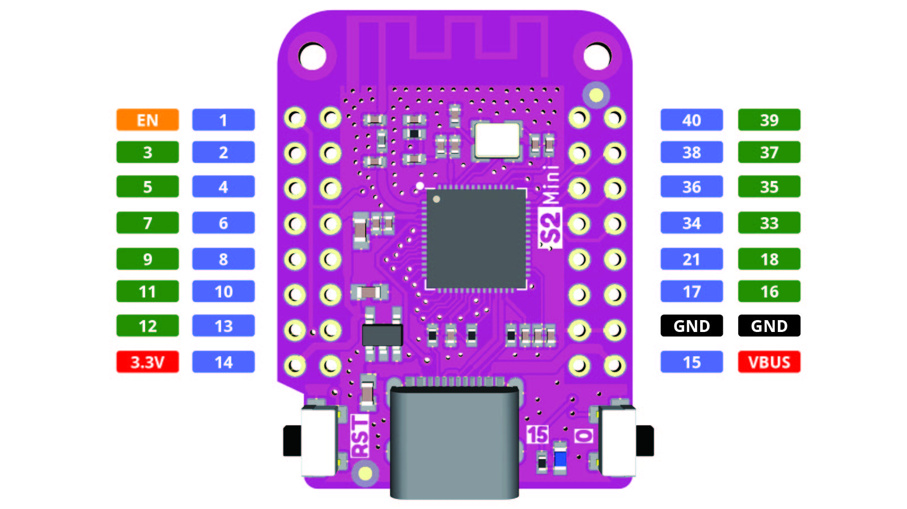

## ESP32s2 example using Azure IoT middleware for FreeRTOS

This project contains code neccesary to connect an ESP23s2 microcontroller to Azure IoT hub and use features such as Over the Air (OTA) Azure Device Update (ADU). In this example a temperature/humidity sensor is connected to the microcontroller. With this "real life" telemetry data can be sent in intervals to IoT hub through MQTT.

This source code is built direcly upon the open source [ESP32](demos/projects/ESPRESSIF/esp32/) sample.

#### Get Started

```bash
git clone https://github.com/mhusberg/iot-middleware-freertos-esp32s2.git
```
<div style="text-align: center">
  
  
<div/>


